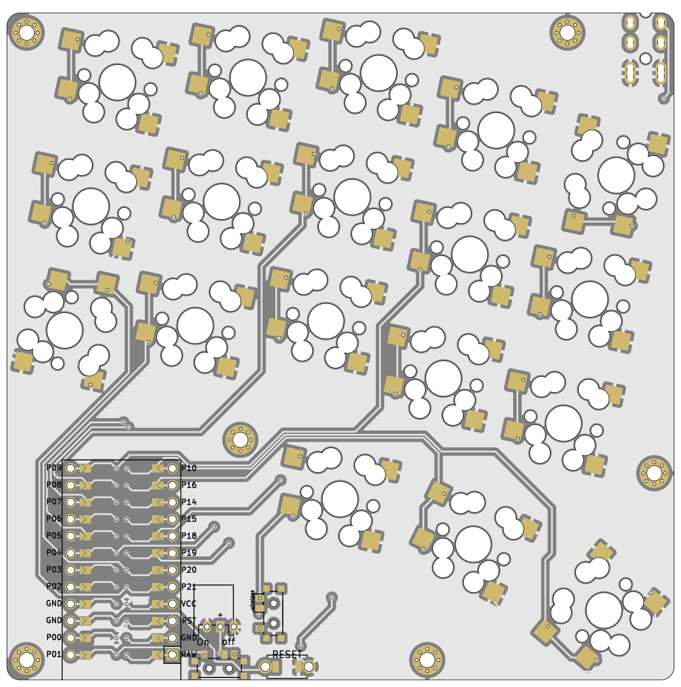
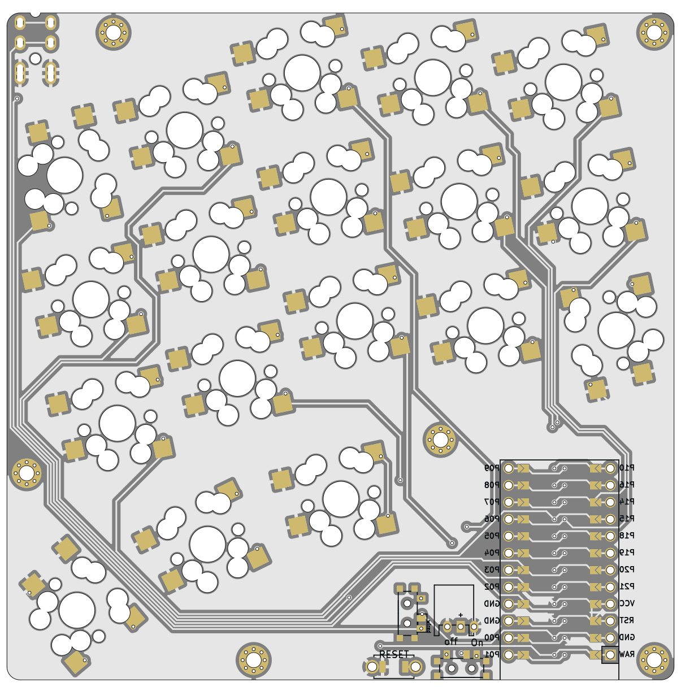

# Sweep Squared
## An autogenerated split 36 key keyboard

## Disclaimer

This is an early experimental prototype. Please do not rely on the autogenerated files and double check them manually
before sending them off to a PCB fab. The author and other random strangers on the internet have been able to produce
working keyboard prototypes from this repo; this does not mean that everything will work every time.

The author(s) waive(s) responsibility for any damage or regulatory violations caused by using this software (see
license). Please consult your local regulations around radio frequencies and what's allowed for DIY projects in your
country.

left | right | outline
-|-|-
 |  | 

A 5x3 split keyboard with 3 thumb keys. 

## Inspiration


- [bgkeeb](https://github.com/sadekbaroudi/bgkeeb)
	- keyboard pcbs under 100mm x 100mm are cheap
- [cheapis](https://github.com/dotleon/cheapis)
	- sweeps can be rotated for more room and length between the thumb cluster and rest of the keys and still fit within 100mm x 100mm
- [samoklava](https://github.com/soundmonster/samoklava) and [ergogen](https://ergogen.cache.works/) to get keyboard layouts programatically
- [sweep](https://github.com/davidphilipbarr/Sweep) and [swweeep](https://github.com/sadekbaroudi/sweep36) for form factor and diode-less design
- [Lily58](https://github.com/kata0510/Lily58/tree/master)
	- key sockets can be hot swappable, reversible, and compatible with both mx and low profile switches
- [totem](https://github.com/GEIGEIGEIST/totem)
	- sandwich case looks really slick and clean, and can also hide the controller parts that will be located under the palm

## Features

- 100mm x 100mm pcb for really cheap fabrication
- reversible footprint
- programatically generated with [ergogen](https://ergogen.cache.works/) (mostly)
- `footprints/key_switches.js` enables deciding between combinations of MX, Choc, or gateron low profile sockets
  > [!WARNING]  
  > still mostly untested, use at your own risk
- jst battery connector and 7-pin slider switch for battery management
- Same key routing as the [swweeep](https://github.com/sadekbaroudi/sweep36)
- Can be both wired and wireless while maintaining a diodless design
  - Features a toggle button to change whether p0 directs to TRRS or the inner thumb key
  - This does mean that the wired version would only support two thumb keys

## Other considerations
- this design does not support LEDs or displays
- pads for gateron low profile hotswap sockets gets cut off by the holes a little: this may or may not be problematic
- [samoklava's](https://github.com/soundmonster/samoklava) auto routing does not really work here
- Still being tested, use at your own risk


## Rendering and generation

Ergogen:
```bash
ergogen -d .
```
Get board image renderings (also done in the [generation](https://github.com/ezxzeng/sweep_squared_rot/actions/workflows/manual_route.yml) workflow):
```bash
docker run -v $(pwd):/kikit --entrypoint pcbdraw yaqwsx/kikit:v1.3.0-v7  plot --style set-white-enig.json routed_pcb/board.kicad_pcb images/board-front.png

docker run -v $(pwd):/kikit --entrypoint pcbdraw yaqwsx/kikit:v1.3.0-v7  plot --style set-white-enig.json --side back routed_pcb/board.kicad_pcb images/board-back.png
```